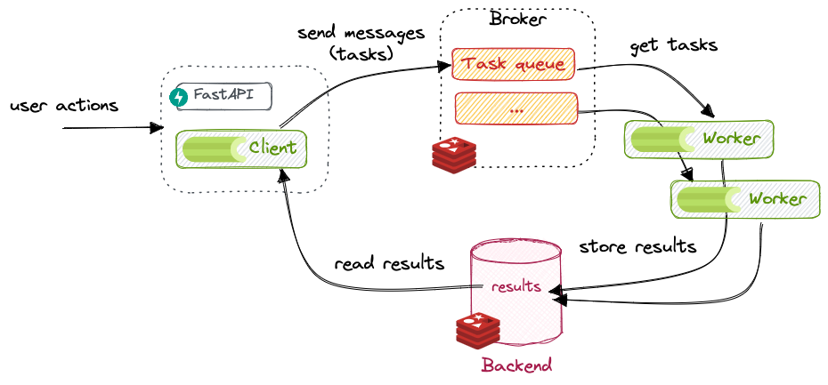

<!-- Celery LOGO -->
<br />
<div align="center">
   

<h3 align="center">Celery project.</h3>
</div>

## Using celery with Fastapi
This project demonstrates the integration of Celery with FastAPI for task management, along with Flower UI.

## Prerequisites
Before you begin, ensure you have the following installed:
 
* [![Python][Python]][Python-url]
* [![FastAPI][FastAPI]][FastAPI-url]
* [![Celery][Celery]][Celery-url]
* [![Redis][redis]][Redis-url]

## Installation
 
You can install FastAPI, Celery, and Redis using pip:
 
```bash
pip install fastapi
pip install celery
pip install redis
```

## Use Cases of Celery:

- Celery can be used for asynchronous task management, such as sending emails, processing data in the background, scheduling periodic tasks, and handling long-running processes.
- It's ideal for scenarios where you need to decouple time-consuming operations from the main application flow, improving responsiveness and scalability.
- Celery is also valuable for distributed computing tasks, parallel processing, and managing complex workflows across multiple systems.

## Integrating Celery with FastAPI:

Integrating Celery with FastAPI involves:
1. Defining tasks in Celery.
2. Configuring Celery settings.
3. Calling Celery tasks asynchronously from FastAPI endpoints.
4. Setting up Celery's message broker, such as Redis or RabbitMQ, and configuring Celery to use it for task distribution.
5. Ensure proper error handling and logging for robust integration.

## When to Use Celery:

Use Celery when:
- You have tasks that can be executed asynchronously to improve application performance and user experience.
- It's suitable for scenarios where you need to handle background processing, schedule tasks, or distribute workload across multiple workers.
- Consider Celery for applications requiring real-time updates, periodic tasks, or offloading heavy computations.

<!-- Celery Diagram -->
## Diagram to understand how celery works.
<br />
<div align="center">
   
</div>

## Configuration
FastAPI Setup
Create a FastAPI application:
```python
from fastapi import FastAPI

app = FastAPI(title="FastAPI celery app")

@app.get("/")
async def read_root():
   return {"message": "Hello, World"}
```

## Create a Celery instance:
Create a file named celery_worker.py:
```python
from celery import Celery
celery_app = Celery('tasks', broker='redis://localhost:6379/0', backend='redis://localhost:6379/0')

@celery_app.task
def add(x, y):
   return x + y
```

## Integration
Now, let's integrate Celery with FastAPI:
 
Import the Celery instance into the FastAPI application:
```python
from fastapi import FastAPI
from celery_worker import add

app = FastAPI(title="FastAPI for Celery with redis")

@app.get("/")
async def read_root(x:int , y:int):
   """Read the root of the application"""
   result = add.delay(x, y)
   return {"message": "Task submitted. Result will be available shortly."}
```
Call Celery tasks from FastAPI endpoints as needed.

## Running the FastAPI Server in Development Mode in one terminal.
Execute the following command to run the server:
```
python run.py
```
Browse Swagger API Doc at: http://localhost:8006/docs
Browse  Redoc at: http://localhost:8006/redoc


## Running the Celery Worker in second terminal.
```
celery -A worker.celery_worker worker -l info
```
- **For Windows Users:**
   #### Execute celery worker with specified queue name.
   ##### 1. " --pool : Specifies the pool implementation to use for Celery workers.",
   ##### 2. " solo : Indicates the 'solo' pool implementation where each task runs in its own process.",
   ##### 3. " -l : Sets the log level, with 'info' indicating logging of informational messages." 
   ```
   celery -A worker.celery_worker worker -Q add_queue,divide_queue,subtract_queue,multiply_queue,chain-queue --pool=solo -l info
   ```
   #### Execute celery worker with info
   ``` 
   celery -A worker.celery_worker worker --pool=solo -l info
   ```

## Monitoring Celery Processes with Flower in third terminal.
```
celery -A worker.celery_worker flower
```

## Starting the Redis Server for Celery.
```
redis-server
```
## Using docker
### Install Redis Image.
```
docker run -p 6379:6379 --name some-redis -d redis
```
### Running Redis Server via Docker
```
docker exec -it some-redis redis-cli ping
```

<!-- MARKDOWN LINKS & IMAGES -->
[Python]: https://img.shields.io/badge/Python-000000?style=for-the-badge&logo=python&logoColor=Blue
[Python-url]: https://docs.python.org/3.10/
[FastAPI]: https://img.shields.io/badge/FastAPI-20232A?style=for-the-badge&logo=fastapi&logoColor=009485
[FastAPI-url]: https://fastapi.tiangolo.com/
[Celery]: https://img.shields.io/badge/celery-008000?style=for-the-badge&logo=celery&logoColor=Blue
[Celery-url]: https://docs.celeryq.dev/en/stable/
[Redis]: https://img.shields.io/badge/redis-%23DD0031.svg?style=for-the-badge&logo=redis&logoColor=white
[Redis-url]: https://redis.io/docs/about/