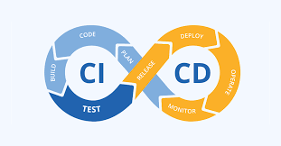

<!-- CI/CD Logo -->
<br />
<div align="center">
   

<h3 align="center">Continuous Integration and Continuous Deployment Guide.</h3>
</div>

## Table of Contents

1. [Description](#description)
2. [What is CI/CD?](#what-is-cd)
3. [Installation](#installation)
4. [Usage](#usage)
5. [GitHub Actions Workflow](#github-actions-workflow)
6. [Dockerfile](#dockerfile)

# Description
## This project is designed to automate the CI/CD process using GitHub Actions, Docker, and FastAPI. The pipeline includes the following steps:
1. Checkout the code.
2. Set up the environment.
3. Build the Docker image.
4. Run tests.
5. Deploy the application.

# What is CI/CD?
- CI/CD stands for Continuous Integration and Continuous Deployment. It's a set of practices that aim to improve the development process by integrating code changes frequently and deploying them quickly and reliably.

- Continuous Integration (CI): This involves automatically testing and integrating code changes into a shared repository multiple times a day. The goal is to detect errors quickly and ensure that the new code integrates well with the existing codebase.

- Continuous Deployment (CD): This extends continuous integration by automatically deploying the integrated code to production environments. Every change that passes all stages of the production pipeline is released to users without human intervention.

### Benefits of CI/CD include:
- Faster and more reliable delivery of new features and bug fixes.
- Improved collaboration and communication among team members.
- Reduced manual efforts and errors through automation.
- Enhanced ability to respond quickly to feedback and changes.

## Installation
## Prerequisites

* Docker installed on your local machine.
* A GitHub repository.
* GitHub Actions enabled in your repository.

## Steps

1. Clone the repository:
```bash
git clone https://github.com/your-username/your-repository.git
cd your-repository
``` 

## Create a .github/workflows directory:
```bash
mkdir -p .github/workflows
```

## Create a docker-compose.yml file in the root directory:

```yml
version: '3.8'
services:
  app:
    build: .
    ports:
      - "8000:8000"
    environment:
      - ENV=production
```

## Create a Dockerfile in the root directory:

```Dockerfile
# Use the official Python image as a parent image
FROM python:3.9

# Set the working directory
WORKDIR /app

# Copy the requirements file into the container
COPY requirements.txt .

# Install any dependencies
RUN pip install --no-cache-dir -r requirements.txt

# Copy the rest of the working directory contents into the container
COPY . .

# Expose port 8000 for the FastAPI app
EXPOSE 8000

# Run the command to start the FastAPI app
CMD ["uvicorn", "main:app", "--host", "0.0.0.0", "--port", "8000"]
```

## Create a requirements.txt file:

```txt
fastapi
uvicorn
```

## Usage
## Running Locally

1. Build the Docker image:
```bash
docker build -t your-app-name .
```

2. Run the Docker container:
```bash
docker run -p 8000:8000 your-app-name
```

3. Access the application:

- Open your web browser and go to http://localhost:8000.

## GitHub Actions Workflow

### Create a workflow file:

- Create a file named ci-cd.yml in the .github/workflows directory.

### Define the workflow:

```yml
name: CI/CD Pipeline

on:
  push:
    branches:
      - main
  pull_request:
    branches:
      - main

jobs:
  build:

    runs-on: ubuntu-latest

    steps:
    - name: Checkout code
      uses: actions/checkout@v2

    - name: Set up Docker Buildx
      uses: docker/setup-buildx-action@v1

    - name: Login to DockerHub
      uses: docker/login-action@v1
      with:
        username: ${{ secrets.DOCKER_USERNAME }}
        password: ${{ secrets.DOCKER_PASSWORD }}

    - name: Build and push Docker image
      uses: docker/build-push-action@v2
      with:
        context: .
        push: true
        tags: your-dockerhub-username/your-app-name:latest

    - name: Deploy
      run: |
        ssh ${{ secrets.DEPLOY_SERVER }} 'docker pull your-dockerhub-username/your-app-name:latest && docker-compose up -d'

```

### Set up GitHub Secrets:
```bash
DOCKER_USERNAME: Your Docker Hub username.
DOCKER_PASSWORD: Your Docker Hub password.
DEPLOY_SERVER: SSH address of your deployment server.
```